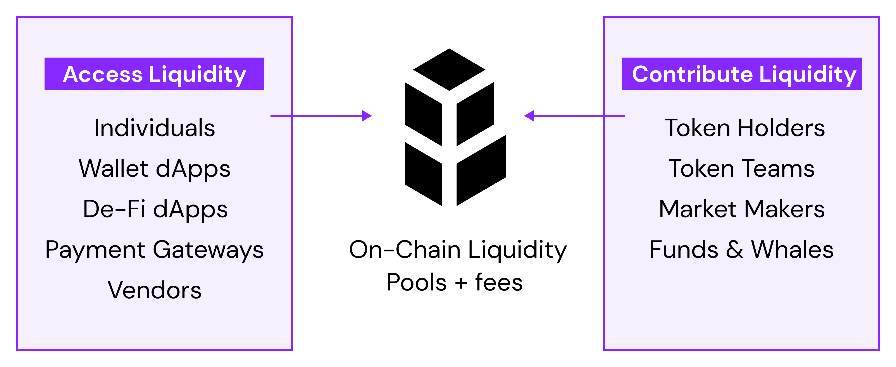

# Introduction

The Bancor Protocol is a fully on-chain liquidity protocol that can be implemented on any smart contract enabled blockchain. The Bancor Protocol is an open-source standard for liquidity pools, which in turn provide one endpoint for automated market-making \(buying / selling tokens\) against a smart contract.

* Bancor Network currently operates on the Ethereum and EOS blockchains, but the Bancor Protocol is designed to be interoperable for additional blockchains. 
* Our implementation can be easily integrated into any application enabling value exchanges. 
* Our implementation is open source and permissionless and the Bancor Protocol is designed to be contributed to and augmented by ecosystem participants. 
* Bancor liquidity pools hold a Bancor network hub token \(BNT or USDB\) and another token in the smart contract. This allows every token every token to be automatically convertible for every other. 

You can learn more about the Bancor Protocol specifications and our implementation of the protocol, various user guides and use case guides, and frequently asked questions on this website.

* Join the [Bancor Developers Telegram group](https://t.me/BancorDevelopers) 
* Check out the [Bancor Blog](https://blog.bancor.network/) 
* Read the Bancor Protocol [Whitepaper](https://storage.googleapis.com/website-bancor/2018/04/01ba8253-bancor_protocol_whitepaper_en.pdf)

