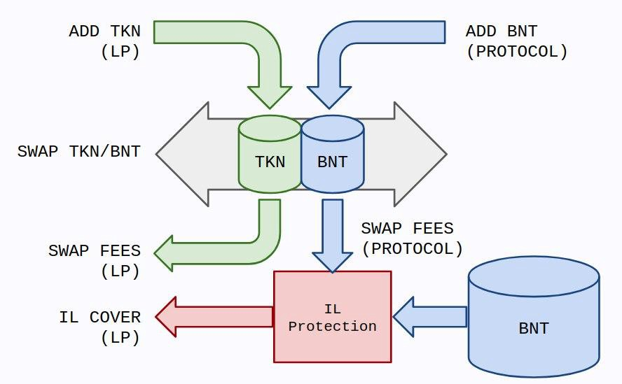

# FAQs

This a living document continuously updated by the community and therefore a work in progress. 

FAQs below are divided into the following sections:

1. \*\*\*\*[**Impermanent Loss**](faqs.md#1-impermanent-loss)
2. \*\*\*\*[**Depositing / Withdrawing Liquidity**](faqs.md#2-depositing-withdrawing-liquidity)
3. \*\*\*\*[**BNT Liquidity Mining**](faqs.md#3-bnt-liquidity-mining)
4. \*\*\*\*[**Pool Management**](faqs.md#4-pool-management)
5. \*\*\*\*[**Helpful Links**](faqs.md#5-helpful-links)
6. \*\*\*\*[**Further Resources**](faqs.md#6-further-resources)

## **1. Impermanent Loss**

## **What is impermanent loss?**

Simply put, impermanent loss is the difference between holding tokens in an automated market maker \(AMM\) liquidity pool and holding them in your wallet.

It occurs when the price of tokens inside an AMM diverge in any direction. The more divergence, the greater the impermanent loss.

Why “impermanent”? Because as long as the relative prices of tokens in the AMM return to their original state when you entered the AMM, the loss disappears and you earn 100% of the trading fees. However, this is rarely the case. More often than not, impermanent loss becomes _permanent_, eating into your trade income or leaving you with negative returns. 

## What causes impermanent loss?

Liquidity pools consist of multiple tokens paired together in a pool. If one of the tokens changes in price relative to its paired token\(s\), an arbitrage opportunity emerges, incentivizing re-balancing of the pool \(and resulting in a loss for liquidity providers\). 

As one token’s price is rising relative to its paired asset, the pool is re-balancing by selling the rising token while buying the token whose price is falling. Once you withdraw your liquidity, you’re left holding less of the token that mooned, and more of the token that dumped.

Swap fees may offset impermanent loss; however in many cases impermanent loss can exceed swap fees earned by an LP, leading to negative returns realized by a liquidity provider upon withdrawing their tokens from the pool. 

Bancor v2.1 is designed to ensure that a liquidity provider gets back the same value of tokens originally deposited \(as if they HODL'd the tokens in their wallet\) plus swap fees using a novel mechanism called **Impermanent Loss Insurance**.

## What is Impermanent Loss Insurance?

Impermanent Loss Insurance is a unique feature offered by Bancor v2.1 that removes the risk of impermanent loss for liquidity providers. LPs can “set and forget” their tokens in a pool and generate fees without living in fear of volatility-induced arbitrage reducing the value of their stake.

Even if a token moons, an LP is entitled to withdraw the full value of the tokens they staked, so long as they have accrued full protection. In other words, if you stake 1 ETH, even if the ETH price doubles, you will still get the equivalent value of 1 ETH back, plus trading fees.

## How does Impermanent Loss Insurance work?

Contrary to other AMM protocols, Bancor uses its protocol token, BNT, as the counterpart asset in every pool. By introducing an elastic BNT supply, the protocol is able to co-invest in pools alongside LPs and pay for the cost of impermanent loss with swap fees earned from its co-investments.

BNT co-invested by the protocol is ultimately burned when an LP withdraws. Similarly, the cost of IL insurance is paid by the protocol when an LP withdraws. The cost of IL insurance may be less than fees earned from BNT co-invested by the protocol, allowing the protocol to offset an LP’s IL without emitting new BNT.

Impermanent loss insurance accrues over time, by 1% each day, until 100% insurance is achieved at 100 days. There is a 30-day cliff, which means that if a liquidity provider decides to withdraw their position before 30 days passes, they’d incur the same IL experienced in a normal, unprotected AMM. If an LP withdraws any time after 100 days, they receive 100% compensation for any loss that occurred in the first 100 days, or anytime thereafter. 

If there are not sufficient tokens in the pool to fully compensate the LP for impermanent loss in the staked token, part of the insurance may be paid out in an equal value of BNT. Learn more in the Bancor v2.1 [**technical explainer**](https://drive.google.com/file/d/16EY7FUeS4MXnFjSf-KCgdE-Xyj4re27G/view) and [**economic analysis**](https://drive.google.com/file/d/1en044m2wchn85aQBcoVx2elmxEYd5kEA/view).

## **Could I lose profits before I reach the 30-day cliff**?

Only if you withdraw your tokens befor 30 days in the pool. Impermanent loss insurance starts vesting immediately when you deposit. But you must be in the pool for at least 30 days until the cliff is reached and before the insurance can be utilized.

## **Where can I track returns and see the current coverage on my liquidity pool position?**

This information can be viewed in the [”Protection” tab](https://app.bancor.network/eth/protection) of bancor.network, on the right side \(where you can also find a countdown timer for complete elimination of impermanent loss\). Each liquidity position has its own separate coverage, depending on when you deposited. Within the same pairs, there is no relation between different liquidity positions.

## **What is the difference between “protected” and “claimable” value?**

Protected value is the amount of tokens you can withdraw with 100% protection + fees.

Claimable value is the amount of tokens you can withdraw right now \(assuming you have not earned full IL protection and there has been IL, this value will be lower than Protected Value\).

## **If I have staked liquidity to a pool multiple times, will withdrawing one of my stakes cancel the other stake’s insurance?**

No. There’s no relation nor correlation between different liquidity providers positions. You can view returns on each of your individual liquidity pool positions in the bancor.network [protection tab](https://app.bancor.network/eth/protection).

## **I withdrew my position and got compensated partially with BNT. Why?**

The protocol co-invests BNT and these BNTs accrue fees. These fees are used to compensate any possible IL. In cases where the trading fees accrued by the co-invested BNT does not outweigh the IL, BNT equivalent \(calculated at the current pool rate\) will be minted from the protocol as compensation.

## **Can I lose my IL insurance somehow?**

Only if you withdraw. If you withdrew before the 30 day cliff, you are not eligible for any insurance. Withdrawing between 30 and 100 days qualifies you for the achieved percentage - for instance, if after 60 days in the pool you withdraw and there is $100 USD worth of IL, you’ll receive compensation for 60% \(or $60 USD\) of the loss.

## **Are all pools eligible for Impermanent Loss Protection?**

Only pools voted into the Bancor v2.1 whitelist by Bancor governance are eligible to receive impermanent loss protection and single-sided exposure. Currently roughly 60 tokens are listed in the Bancor v2.1 whitelist. 

[_**Instructions on how to whitelist a token**_](https://bancor.medium.com/how-to-whitelist-a-token-on-bancor-v2-1-c867b82675d4)_**.**_

## 2. Depositing / Withdrawing Liquidity

## How do I stake in the Bancor protocol?

You can swap or stake with Bancor protocol on bancor.network or any site integrated with Bancor smart contracts. Users connect via Web3 wallets such as MetaMask. Make sure your wallet is connected by checking the connection status in the upper right-hand corner of bancor.network.

## I have a hardware wallet. Can that be used as well?

Yes. MetaMask supports hardware wallets like Trezor and Ledger directly. There’s no need to keep it connected to your PC after you’ve finished with the interactions.

## Where are the funds being deposited to?

Funds are sent to a smart contract that keeps record of the liquidity, but you always maintain ownership - it's non-custodial as it is based on the smart contracts.

## If they’re not in my wallet, how do I maintain ownership?

Your hardware wallet, like a ledger, is not a storage device; it is an encryption device. So when you 'move' coins into a ledger wallet, you are really just moving them to an address on the blockchain, that can only be decrypted by the ledger. Staking from the ledger just means that the ledger encrypted address will still maintain control of the coins. And interacting with the contract will require the ledger for cryptographic signing. This means that any interaction with the Bancor protocol will require the physical ledger device. i.e it is impossible for a hacker to do anything with your funds without the ledger in their hands.

## I’m ready to stake my tokens as liquidity. What options do I have?

There are two ways to provide liquidity on Bancor - dual sided or single sided.

**1. Single-asset staking \(single-sided exposure\)**: Bancor’s unique design gives you the option to remain 100% long on your favorite token while earning swap fees & liquidity mining rewards. In most liquidity pools, deposits require selling part of the staked tokens for ETH or another “reserve asset” like USDC, exposing the LP to a different asset during the staking period. With Bancor single-asset staking, you do not have to sell part of your tokens and be exposed to another token in the pool.

Specifically for single-asset staking of BNT \(or any impermanent loss insurance paid out in BNT\), any BNT being withdrawn from the system is subject to a 24-hour lockup to guarantee the security of the protocol and its pools.

[**You can view a guide by clicking here.**](https://blog.bancor.network/guide-single-sided-amm-staking-on-bancor-v2-1-93e6839959ba)

**2. Dual-sided staking:** You provide both sides of the pair. i.e., LINK and BNT for the LINK/BNT pool. If you provide dual-sided liquidity, please make sure you protect the position via the [protection tab](https://app.bancor.network/eth/protection) “Stake” button to get impermanent loss insurance. The LINKBNT token that you received in your wallet should ultimately be sent to the pool’s protection contract.

## Why is there no space available for my tokens in certain pools?

The option to provide single-sided liquidity is available only if there’s sufficient space on the other side of the pair, which is BNT. 

If there is not enough space in a given pool for providing single-sided ERC20 liquidity, an LP has two options: provide BNT to open up space, or provide dual-sided liquidity \(BNT + ERC20\).

## How much ETH do I need to pay to stake in a Bancor pool? 

Any transaction on the Ethereum network costs gas. You can look at estimations once you attempt to transact, the gas prices should appear on MetaMask. You can also check gas prices by checking [Eth Gas Station](https://ethgasstation.info/).

## I’m getting an error or very high transaction fee, such as triple digits. What gives?

This may be due to a contract bug. You should not approve it, and instead refresh your browser and MetaMask,  or reconnect the wallet and try again. If you still experience issues, please reach out to us via [ban.cr/support](www.ban.cr/support).

## What is vBNT?

vBNT is a token you receive once you provide BNT as liquidity in the protocol. It is used for on-chain voting, via [https://app.bancor.network/eth/vote/](https://app.bancor.network/eth/vote/). If activated, the system can generate swap fees distributed to vBNT holders. See [**BIP-8**](https://gov.bancor.network/t/add-an-admin-fee-to-be-partially-burned-distributed-to-bnt-holders/245) for more details.

You will need to stake your vBNT in the governance contract in order to vote. Once staked, there’s a 72-hour lockup period to unstake. To withdraw BNT, you must have vBNT in your wallet.

Governance ERC20 address: 0x48Fb253446873234F2fEBbF9BdeAA72d9d387f94

[**Voting Guide**](https://blog.bancor.network/bancor-v2-1-staking-guide-749e5cc4326a)

## I’ve added liquidity, now where can I keep track of my liquidity pool positions and returns?

Please check the [**protection tab**](https://app.bancor.network/eth/protection) to see all metrics for the different LP positions you have, such as how many fees you’ve earned, your ROI \(return on investment\), daily/weekly APR \(annual percentage rate\) and more.

## What kind of fees can you earn?

If you deposit dual-sided liquidity, you’ll get fees swaps in both direction. For single-sided, you’ll get the swap fees for swaps in one direction. The APY is dependent on trading activity, and fluctuates accordingly, as well as BNT liquidity mining rewards that Bancor governance has approved for distribution to the pool on a weekly basis.

## How can I see how much I’ve earned?

Please refer to the “Fees” column in the [**Protection tab**](https://app.bancor.network/eth/protection)**.**

## How do pools become profitable for liquidity providers?

As a pool increases in size and more liquidity is added, it attracts more swaps and generates more swap fees for LPs. The deeper the pool gets, the lower the slippage. So deep pools attract the most and largest swaps - and therefore more fees.

## Why is APR changing & how is it calculated?

The APR \(or annual percentage return\) depends on how many swaps are executed in the pool within a given time frame. The more swaps, the higher the APR will be, and vice versa. On bancor.network, these fees are measured on are measured within a given time frame \(1-day, 7-day and 1-month\), divided by current liquidity in the pool, and then annualized. For example if there are $30,000 worth of fees in a pool with $10M liquidity over the course of 7 days. The APR is $30,000 / $10,000,000 \* 100 \* 52 weeks = 15.6%. 

APR from BNT Liquidity Mining is measured similarly. BNT distributed to the pool in a given week, divided by liquidity, and then annualized.

## 3. BNT Liquidity Mining

## What is the Liquidity Mining \(LM\) program?

BNT Liquidity Mining \(LM\) program started at November 16 and aims at achieving two primary goals:

1. Attracting new liquidity into Bancor pools
2. Creating stickiness to incentivize long-term liquidity provision

You can read about it in the [Medium blogpost](https://blog.bancor.network/announcing-bnt-liquidity-mining-b30be90a008d) or a detailed information in the proposal itself [here](https://gov.bancor.network/t/proposal-liquidity-mining/179).

## When did it start, and for how long does the LM program last?

The program started on November 16, however rewards will be sent retroactively once the restaking/claiming mechanism is live. It will last for a year and a half - 72 weeks total.

## How long does a selected rewards pool receive rewards?

A pool that is selected for LM rewards receives it for 84 consecutive days \(12 weeks\). It may get voted again once its reward cycle ends, subject to the governance decision.  

## Which pools are eligible for rewards?

Only whitelisted pools are eligible for rewards. Of the rewards pool, the program initially started with 8 pools: 6 “large cap” and 2 “mid cap” pools. \(Large cap pools receive 100,000-200,000 BNT per week, while Mid cap pools receive 10,000-20,000 BNT per week.\)

**Large caps:** ETH,WBTC,USDT,USDC,DAI,LINK

**Mid caps:** OCEAN, renBTC

[REN & YFI were picked](https://blog.bancor.network/bancor-progress-update-november-2020-2a32db170c8c?postPublishedType=repub) as additional two new mid cap pools for LM rewards on December 3rd. 

Governance voting for new tokens to be added to the BNT liquidity mining rewards program will take place every two weeks.

This is subject to change if the governance deem it necessary \(i.e., mid cap pool becomes very liquid, and gets voted to become a large cap pool\).

## How do I get my favorite token to receive LM rewards?

Every two weeks, two new tokens can be added to the program. Once activated, a token’s pool will receive BNT rewards for 12 consecutive weeks. If your token is whitelisted, it can be proposed as a pool that can receive LM.

## What is a whitelisted pool?

A whitelisted pool is a pool deemed worthy by BNT governance to receive IL insurance, single-sided staking and possibly LM rewards \(subject to a separate on-chain voting\). You can request to whitelist new projects by initiating discussion on Discord and in the Bancor governance forum. See ****[**instructions on how to whitelist a token**](https://bancor.medium.com/how-to-whitelist-a-token-on-bancor-v2-1-c867b82675d4). Below is the initial list of whitelisted pools:  

_AAVE, ALEPH, ANT, BAL, BAND, BAT, BNB, BUSD, BZRX, CEL, CHERRY, COMP, CRO, CRV, DAI, DXD, ELF, ENJ, ETH, EWTB, FTT, GNO, gUSD, JRT, KNC, LEND, LINK, LRC, MANA, MATIC, MKR, MLN, MTA, NMR, OCEAN, OMG, pBTC, RARI, RCN, REN, renBTC, renZEC, RPL, RSR, SNX, SRM, STAKE, sBTC, sUSD, SUSHI, SWRV, SXP, TRB, TOMOE, UNI, USDC, USDT, WBTC, wNXM, XDCE, YFI, UMA, QNT, ZRX._

## How are BNT liquidity mining rewards distributed?

BNT liquidity mining rewards will be distributed as follows: 70% to the BNT side of the liquidity pool and 30% to the base ERC20 token side of the pool. Rewards are distributed on a weekly basis.

## What token do I receive the rewards in?

The rewards from the LM program are provided in BNT only. This is unrelated to the swap fees, which comes from trading activity on that pool.

## How can I claim the rewards?

One place you will be able to claim the rewards in the protection tab in the bancor.network front-end. You will have two options available:

1.Claim and re-stake: You will be able to choose a pool to direct your BNT rewards to, increasing the protocol’s and the relevant pool’s liquidity depth, compound your gains and maintain the 2x multiplier.

2.Withdraw to your wallet: withdraw the BNTs directly to your wallet, resetting your multiplier for all of your LP positions, cutting your APY% by half.

More detailed guides will be shared once rewards are activated and go live in the bancor.network front-end.

## What is a rewards “multiplier”?

Liquidity providers who keep their rewards staked to the protocol receive a “Bonus Rewards Multiplier”, which increases their BNT rewards by up to x2 per week. If you reset your multiplier by withdrawing your BNT rewards or by withdrawing your LP position, you will have to wait for four weeks to get the 2x multiplier into full effect \(0.25x added each week\).

## 4. Pool management

## How to create a new pool to Bancor?

Go to [https://app.bancor.network/eth/pool/create](https://app.bancor.network/eth/pool/create). Select the ratio \(we recommend 50/50 as only 50/50 pools can currently become eligible for IL insurance, single-sided exposure and liquidity mining rewards\). Select the token and click continue. Note that this is a complex transaction which might cost more gas than a usual transaction.

## How to get a pool whitelisted for single-sided staking and impermanent loss protection?

Please check out this guide: [https://medium.com/@bancor/how-to-whitelist-a-token-on-bancor-v2-1-c867b82675d4](https://medium.com/@bancor/how-to-whitelist-a-token-on-bancor-v2-1-c867b82675d4)

## Who manages the pool’s fee?

Currently, pool owners determine the pool's fee, however this is subject to change via governance, with the introduction of a standardized fee that is dynamic or the introduction of LP voting on each pool's fees. More information can be found in Bancor's Discord and Governance forum.

## 5. Helpful Links

* Telegram groups: [Bancor Protocol](https://t.me/bancor), [Bancor Devs](https://t.me/BancorDevelopers), [Bancor Traders](https://t.me/bancortraders)
* [Bancor Discord](https://discord.gg/pe7EfaR)
* Governance: [http://gov.bancor.network/](http://gov.bancor.network/)
* Bancor blog: [https://medium.com/@bancor/](https://medium.com/@bancor/)
* Bancor.network customer support: [ban.cr/support](www.ban.cr/support)
* [BNT/REN telegram staking support](https://t.me/joinchat/BFCB_VbQ_fRI8SoNH7GpQw)
* [BNT/OCEAN telegram staking support](https://t.me/joinchat/FBrMHUs2dBSuPSalm6ZntQ)
* [BNT Liquidity Mining telegram support](https://t.me/joinchat/Rd10hRzdd0hRSdySGhNk7Q)

## 6. Further Resources

* [Bancor v2.1 Economic Analysis](https://drive.google.com/file/d/1en044m2wchn85aQBcoVx2elmxEYd5kEA/view): 
* [Bancor v2.1 Technical Explainer](https://drive.google.com/file/d/16EY7FUeS4MXnFjSf-KCgdE-Xyj4re27G/view)
* [GUIDE: Single-Sided Staking on Bancor V2.1](https://blog.bancor.network/guide-single-sided-amm-staking-on-bancor-v2-1-93e6839959ba)
* [Bankless: How Bancor v2.1 protects LPs from impermanent loss](https://bankless.substack.com/p/how-to-protect-yourself-from-impermanent)
* [How to submit a BIP in Bancor Goverance](https://medium.com/@bancor/how-to-launch-a-bip-vote-with-bancor-governance-bc0887d8c923)
* [How to Whitelist a Token on Bancor v2.1](https://medium.com/@bancor/how-to-whitelist-a-token-on-bancor-v2-1-c867b82675d4)
* [Bancor November 2020 progress update ](https://blog.bancor.network/bancor-progress-update-november-2020-2a32db170c8c)

