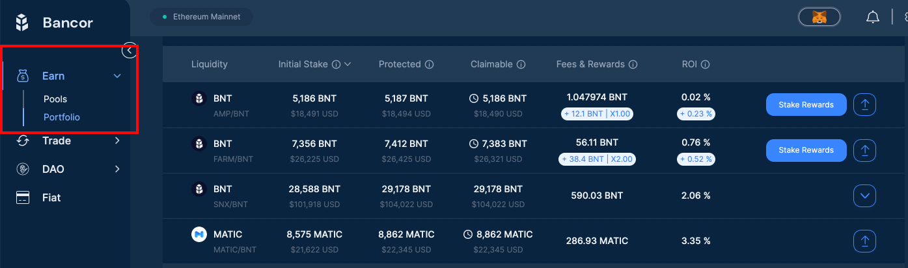

# Bancor Basics

This a living document continuously updated by the community and therefore a work in progress. It is divided into the following sections:

1. ****[**Liquidity Pools**](faqs.md#1.-liquidity-pools)****
2. ****[**Impermanent Loss/Divergence Loss**](faqs.md#2.-impermanent-loss)****
3. ****[**Bancor Safe Staking** ](faqs.md#3.-bancor-safe-staking)****
4. ****[**Depositing & Withdrawing Liquidity**](faqs.md#3.-depositing-withdrawing-liquidity)****
5. ****[**Liquidity Mining Rewards**](faqs.md#5.-liquidity-mining-rewards)****
6. ****[**Pool Management**](faqs.md#5.-pool-management)****
7. ****[**Trading**](faqs.md#6.-trading)****
8. ****[**Further Resources**](faqs.md#7.-further-resources)****
9. ****[**Helpful Links**](faqs.md#8.-helpful-links)****

## **1. Liquidity Pools** 

Liquidity pools are automated market-maker **** (AMM) smart contracts that exchange assets algorithmically using on-chain reserves.

Liquidity on traditional asset exchanges has historically been controlled by a small handful of professional trading firms or “market makers”. These market makers can choose to suddenly withdraw their liquidity during periods of volatility, restricting the trading of an asset when users need it the most.

In contrast, AMM pools allow liquidity to flow from an unlimited number of everyday users, lowering the barrier to token creation and yield generation, and increasing resistance to market manipulation and censorship.

Launched in June 2017, Bancor created the first-ever AMMs on the blockchain. Since then, AMM liquidity pools have evolved into a core building block of decentralized finance (DeFi), attracting over $30 billion in locked value across numerous blockchains.

## **2. Impermanent Loss / Divergence Loss**

Impermanent loss (or "divergence loss") is the difference between holding tokens in an AMM liquidity pool and holding them in your wallet.

It occurs when the price of tokens inside an AMM diverge in any direction. The more divergence, the greater the risk of negative returns.

It is referred to as "impermanent" because the loss is only realized when you withdraw from a pool. If the relative prices of tokens in the AMM return to their original state when you deposited your tokens, the loss is minimized or eliminated.

However, this is rarely case. More often, the losses become _permanent_ the moment you withdraw your tokens from a pool. These losses reduce your income from trading fees and rewards, and can wipe out your entire share of profits, leaving you with negative returns versus simply holding your tokens in your wallet.

### What Causes Impermanent Loss?

Liquidity pools consist of multiple tokens paired together in a pool. If one of the tokens changes in price relative to its paired token, an arbitrage opportunity emerges, incentivizing re-balancing of the pool by third-party arbitrage traders.&#x20;

During re-balancing, the pool automatically sells the rising token at a discount and buys the token whose price is falling at a premium. As an LP, you are left holding less of the token that mooned, and more of the token that dumped. Over time, the effect causes the cumulative value of your pool holdings to be worth less than if you simply held the two assets in your wallet.

* _**Check if you've been rekt by IL on**_ [_**IL.wtf**_](https://il.wtf)
* _****_[_**Learn more about IL**_](https://earn.bancor.network/impermanent-loss)_****_
* _**A technical explanation of IL can be found in the section "Impermanent Loss in a Traditional AMM" in**_ [_**this paper**_](https://arxiv.org/pdf/2111.09192.pdf)_**.**_

### What's the Risk of Impermanent Loss?

Recent [on-chain research](https://arxiv.org/abs/2111.09192) analyzing over 20,000 liquidity provider positions and over $100 billion in trading volume shows that users providing liquidity to unprotected AMM pools suffered negative returns **roughly 50% of the time**.

We consider this risk to be intolerable for most users, which is why we designed a safer and simpler way to earn on your favorite tokens called "[Bancor Safe Staking](https://earn.bancor.network/safe-staking/)".

## 3. Bancor Safe Staking

Bancor Safe Staking allows users to deposit their tokens in a liquidity pool and passively earn yield with **single-token exposure** and **zero risk of impermanent loss**.

The protocol is designed to ensure that a depositor ("LP") gets back the same value of tokens originally deposited (as if they held the tokens in their wallet) using a novel mechanism called **Impermanent Loss Protection**.

Even if a token moons, the LP is protected and entitled to withdraw the full value of the tokens they staked, so long as they have accrued full protection (see "IL Protection Vesting" below).

For example, if you stake 1 ETH, even if the ETH price doubles, you will still get the equivalent value of 1 ETH back plus trading fees (earned in ETH) and rewards (earned in BNT).

## How Does Impermanent Loss Protection Work?

Bancor uses its protocol token, BNT, as the counterpart asset in every pool. Using an elastic BNT supply, the protocol is able to provide liquidity alongside an LP and compensate them for any IL with swap fees earned from protocol-owned LP tokens.

If fees earned from protocol-owned LP tokens are greater than the cost of IL compensation, the protocol is able to entirely offset IL for the LP without emitting new BNT. If there are ever insufficient protocol-earned fees to fully compensate an LP for their IL, the protocol's IL protection may be paid out in an equal value of emitted BNT.&#x20;

Bancor's continuous burning mechanisms put deflationary pressure on the BNT token supply. The initial BNT provided by the protocol, in addition to the fees it earns (less any IL compensation), are burned when an LP withdraws from the system.&#x20;

In addition, a portion of transaction fees generated on the network are used to burn vBNT (which represents staked BNT) via the [Bancor Vortex](https://blog.bancor.network/vbnt-burning-is-live-cd814c2b07fa).

### IL Protection Vesting

When a user makes a new deposit, the IL Protection offered by the protocol increases at a rate of 1% each day the stake remains live, and matures to full protection after 100 days.&#x20;

After a period of 100 days, any impermanent loss incurred in the first 100 days or any time thereafter is covered by the protocol at the time of withdrawal. Withdrawals prior to the 100-day maturity are only eligible for partial compensation. For example, withdrawals after 60 days in the pool receive 60% compensation on any impermanent loss incurred. Also, there is no compensation offered at all for stakes withdrawn within the first 30 days.

_Note that in Bancor v3, IL Protection Vesting will be replaced with "Instant IL Protection" (100% protection from day one) with a 7-day cool-down period._ [_More info_](https://twitter.com/Bancor/status/1469013464010137602?s=20)_._

## How Single-Sided Liquidity Works

Single-sided liquidity means you can provide a single token (instead of two) to a liquidity pool and maintain 100% exposure to the price movements of that token during the staking period. Bancor's IL Protection is a required feature to enable single-sided liquidity provision.

To support single-sided liquidity across 100+ whitelisted tokens, the Bancor protocol uses its protocol-owned liquidity to jointly fund pools alongside users. In other words, when a user deposits $100,000 in a supported token ("TKN"), the protocol matches the user's deposit by providing $100,000 in BNT to the pool.

Protocol-provisioned BNT earns fees from trading the same way user deposits do. These fees are burned for BNT and vBNT, and used to compensate for any IL incurred by users when they withdraw their tokens from the protocol.

The amount of BNT offered by the protocol to support trading in a given token is governed by the Bancor DAO. The DAO aims to offer protocol liquidity in amounts that are profitable for the network, i.e., where trading fee income exceeds the cost of IL protection.

## 4. Depositing / Withdrawing Liquidity

## How do I stake in the Bancor Protocol?

You can stake and earn on 100+ tokens in the Bancor protocol on [bancor.network](https://app.bancor.network/eth/data) or any site integrated with Bancor smart contracts. Users connect via Web3 wallets such as MetaMask.

([video tutorial](faqs.md#liquiditypools)).

Watch the founder of Axie Infinity walk through staking in Bancor:


AXS is one of 100+ tokens whitelisted by the Bancor protocol, allowing users to stake and earn AXS with single-token exposure and zero impermanent loss.


**Read:** [**Step-by-step staking guide**](https://blog.bancor.network/guide-single-sided-amm-staking-on-bancor-v2-1-93e6839959ba)****

## **Where can I track returns after depositing liquidity?**

This information can be viewed in the "Portfolio" tab under the "Earn" section of [app.bancor.network](https://app.bancor.network). Your Bancor Earn Portfolio allows you to connect your wallet and track your individual LP positions including fees earned, your ROI (return on investment) and more.

For each individual stake in a pool, the Portfolio page displays:

* “**Initial Stake**” — the total number of tokens initially staked
* “**Protected**” — the value of your position with full 100% protection
* “**Claimable**” — value available for withdrawal. If IL has occurred, and the stake is less than 100 days old, Claimable will be lower than Protected.
* **"Fees & Rewards"**
  * total fees paid in BNT or non-BNT tokens, depending on whether you've staked BNT or non-BNT tokens
  * total rewards (BNT mining rewards) paid on a given pool position. Your rewards multiplier accrues weekly with a max at X2 after 4 weeks in a pool. Multipliers on _all_ active LP positions reset if an LP withdraws liquidity from _any_ Bancor pool.
* **ROI** — An LP's ROI, or "return on investment", is calculated as follows:&#x20;
  * `Protected Stake Value-Initial Stake Value/Initial Stake Value*100`

Read: [**How to Provide Liquidity on Bancor**](https://blog.bancor.network/how-to-stake-liquidity-earn-fees-on-bancor-bff8369274a1)****

## What is vBNT?

vBNT is the governance token of Bancor. Users who stake BNT in any whitelisted pool receive vBNT in return representing their % ownership of the pool. This makes vBNT similar to an LP token, except you can also use it to vote in Bancor governance via [https://app.bancor.network/eth/vote/](https://app.bancor.network/eth/vote/).

When using vBNT to vote, you will need to stake your vBNT in the governance contract as a first step. Once staked, there’s a 72-hour lockup period to un-stake vBNT from the governance contract. [**Voting Guide**](https://blog.bancor.network/bancor-v2-1-staking-guide-749e5cc4326a)

Per the[ **vBNT Burner Proposal**](https://gov.bancor.network/t/bancor-vortex-part-2-vbnt-whitelist-proposal/537)**,** a 5-20% share of network trading fee revenue can be used to buy and burn vBNT, reducing the circulating supply of BNT tokens and locking BNT in the protocol permanently.

To withdraw staked BNT from a pool, you must have the same number of vBNT in your wallet, though not necessarily the same vBNT tokens. In other words, you can trade your vBNT for other tokens while your BNT is staked, and buy vBNT back if/when you want to withdraw your BNT from Bancor. Only your wallet can withdraw your staked BNT using the necessary number of vBNT.

**Make sure you** [**understand the risks of trading your vBNT** ](https://blog.bancor.network/using-bancor-vortex-46974a1c14f9)**before doing so.**

## What kind of fees can you earn from Bancor pools?

When you deposit your tokens on Bancor, you earn a percentage fee from trades that occur in the token you've staked. For example, if you deposit LINK, you will earn a fee from trades that occur in LINK. The estimated annual percentage return (APR) is dependent on trading and other network activity, and fluctuates accordingly, as well as liquidity mining rewards that Bancor governance approves per pool.

The [bancor.network](https://app.bancor.network/eth/data) front-end estimates APR based off the past 24h of trading fees. The APR also includes mining rewards (if they are listed as "Active" in the "Rewards" column). Trading fees are paid in the token you've staked, whereas rewards can be paid out in the tokens you've staked or BNT.

.png>)

## How do pools become profitable for liquidity providers?

As a pool increases in size and more liquidity is added, it attracts more trades and generates more trading fees for LPs. The deeper the pool, the lower the slippage. So deep pools attract the most and the largest trades - and therefore more trading fees.

## Why is APR changing & how is it calculated?

"APR" in the [Pools table](https://app.bancor.network/eth/data/) refers to annual percentage returns from both trading fees and mining rewards.

The bancor.network front-end measures estimated APR from these two sources:&#x20;

1. **Trading fees**: APR from trading fees is calculated by measuring the total fees earned by the pool over a given time (e.g., 1 day or 7 days), dividing it by the current liquidity in the pool, and then annualizing it. For example, if there are $30,000 worth of fees in a pool with $10M liquidity over the course of 7 days, the APR is $30,000 / $10,000,000 \* 100 \* 52 weeks = 15.6%.&#x20;
2. **Liquidity Mining Rewards**: APR from rewards is measured similarly. Rewards distributed to the pool in a given week, divided by liquidity, and then annualized. The "Rewards" column in the Pools table indicates whether rewards are currently "Active" in a given pool.

In Bancor v2.1, trading fees automatically accrue in the pool, compounding the LP's gains. Liquidity mining rewards, on the other hand, accrue in a separate rewards contract, requiring an individual LP to manually re-add their earned rewards to the pool. In Bancor v3, both trading fees and liquidity mining rewards are **auto-compounding** ([more info](https://twitter.com/Bancor/status/1474026588190744581?s=20)).

## **If I have staked liquidity to a pool multiple times, will withdrawing one of my stakes cancel the other stake’s IL Protection?**

No. There’s no relation or correlation between different liquidity providers positions. You can view returns on each of your individual liquidity pool positions in "Portfolio" section under the "Earn" tab in [app.bancor.network](https://app.bancor.network/pools).

## **I withdrew my position and got compensated partially in BNT. Why?**

The protocol provides BNT to its pools and these BNTs accrue fees from trading. These fees are used to compensate any possible IL. In cases where the trading fees accrued by protocol-owned BNT does not outweigh the IL, BNT equivalent (calculated at the current pool rate) will be emitted from the protocol as compensation.&#x20;

Note: BNT withdrawn from the system is subject to a 24-hour lock-up.

## **Can I lose my IL insurance somehow?**

Only if you withdraw. If you withdrew before the 30 day cliff, you are not eligible for any insurance. Withdrawing between 30 and 100 days qualifies you for the achieved percentage - for instance, if after 60 days in the pool you withdraw and there is $100 USD worth of IL, you’ll receive compensation for 60% (or $60 USD) of the loss.

## **Are all pools eligible for Impermanent Loss Protection?**

Only pools voted into the Bancor v2.1 whitelist by Bancor governance are eligible to receive impermanent loss protection and single-sided exposure. At the time of this writing, there are over 85 tokens whitelisted in Bancor v2.1.&#x20;

_**Instructions on how to whitelist a token.**_

## I have a hardware wallet. Can that be used as well?

Yes. MetaMask supports hardware wallets like Trezor and Ledger directly. There’s no need to keep it connected to your PC after you’ve finished with the interactions.

## Where are the funds being deposited to?

Funds are sent to a smart contract that keeps record of the liquidity, but you always maintain ownership - it's non-custodial as it is based on the smart contracts.

## If they’re not in my wallet, how do I maintain ownership?

Your hardware wallet, like a Ledger wallet, is not a storage device; it is an encryption device. So when you 'move' coins into a ledger wallet, you are really moving them to an address on the blockchain, that can only be decrypted by the ledger. Staking from the Ledger just means that the Ledger encrypted address will still maintain control of the coins. And interacting with the contract will require the Ledger for cryptographic signing. This means that any interaction with the Bancor protocol will require the physical Ledger device.

## Why is there no space available for my tokens in certain pools?

The option to provide single-sided liquidity is available only if there’s sufficient space on the other side of the pair, which is BNT.&#x20;

If there is not enough space in a given pool for providing single-sided ERC20 liquidity, an LP has two options: provide BNT to open up space, wait until another user provides BNT to open space, or work with governance to increase the limit of protocol-owned BNT that can be provided to the pool.

## How much ETH do I need to pay to stake in a Bancor pool?&#x20;

Any transaction on the Ethereum network costs gas. You can look at estimations once you attempt to transact, the gas prices should appear on MetaMask. You can also check gas prices by checking [Eth Gas Station](https://ethgasstation.info).

## I’m getting an error or very high transaction fee. What gives?

This may be due to a contract bug. You should not approve it, and instead refresh your browser and MetaMask, or reconnect the wallet and try again. If you still experience issues, please reach out to us via [ban.cr/support](https://www.ban.cr/support).

## 5. Liquidity Mining Rewards

## What is the BNT Liquidity Mining (LM) program?

BNT Liquidity Mining (LM) program aims to achieve two primary goals:

1. Attract new liquidity into Bancor pools
2. Create stickiness to incentivize long-term liquidity provision

You can read about it in the [Medium blogpost](https://blog.bancor.network/announcing-bnt-liquidity-mining-b30be90a008d) or detailed information in the original BNT Liquidity Mining proposal [here](https://gov.bancor.network/t/proposal-liquidity-mining/179).

## How long does a selected LM pool receive rewards?

The period of time a pool receives rewards is configurable and is voted on by the BancorDAO and subject to the governance decision via on-chain voting.

## Which pools are eligible for rewards?

Only whitelisted pools are eligible for rewards.&#x20;

Voting for new tokens to be added to the BNT liquidity mining rewards program is subject to the community and the BancorDAO. You can see the pools that have rewards as they'll "Active" in the "Rewards" section.

## How do I get my favorite token to receive LM rewards?

If your token is whitelisted, it can be proposed as a pool that can receive LM. Reach out to the governance via our[ Discord chat!](https://discord.gg/pe7EfaR)

## What is a whitelisted pool?

A whitelisted pool is a pool deemed worthy by BNT governance to receive IL insurance, single-sided staking and possibly LM rewards (subject to a separate on-chain voting). You can request to whitelist new projects by initiating discussion on Discord and in the Bancor governance forum. See **** [**instructions on how to whitelist a token**](https://bancor.medium.com/how-to-whitelist-a-token-on-bancor-v2-1-c867b82675d4). Below is the **initial** list of whitelisted pools: &#x20;

_AAVE, ALEPH, ANT, BAL, BAND, BAT, BNB, BUSD, BZRX, CEL, CHERRY, COMP, CRO, CRV, DAI, DXD, ELF, ENJ, ETH, EWTB, FTT, GNO, gUSD, JRT, KNC, LEND, LINK, LRC, MANA, MATIC, MKR, MLN, MTA, NMR, OCEAN, OMG, pBTC, RARI, RCN, REN, renBTC, renZEC, RPL, RSR, SNX, SRM, STAKE, sBTC, sUSD, SUSHI, SWRV, SXP, TRB, TOMOE, UNI, USDC, USDT, WBTC, wNXM, XDCE, YFI, UMA, QNT, ZRX._

## How are BNT liquidity mining rewards distributed?

BNT liquidity mining rewards will be distributed as follows: 70% to the BNT side of the liquidity pool and 30% to the base ERC20 token side of the pool. Rewards are distributed continuously per block.

## What token do I receive the rewards in?

The rewards from the LM program are provided in BNT only. This is unrelated to the swap fees, which comes from trading activity on that pool and may be received in the staked token.

## How can I see, stake or withdraw BNT rewards?

First, visit the "Portfolio" section under the "Earn" tab in [app.bancor.network](https://app.bancor.network/pools). At the top right side you will see a Rewards dashboard, showing total rewards to date, and the claimable amount you currently can stake or withdraw. From there, you have three options:

1.Stake: You will be able to choose a pool to direct your BNT rewards to. Staking your BNT rewards allows the rewards to earn swap fees and additional rewards, which can also be staked, while maintaining bonus multipliers on all live stakes.

2\. Hold: Holding rewards in the contract has no impact on your bonus multipliers; however, doing so will not generate additional rewards. You can stake or withdraw your rewards from the rewards contract at any time. There is no deadline to take action.&#x20;

3.Withdraw: Withdrawing your BNT rewards sends the rewards directly to your wallet and **resets your multipliers to 1x** on _all of your existing LP positions_. This temporarily reduces your earnings potential on your staked liquidity until the multipliers return.

## What is the Bonus Rewards Multiplier?

Liquidity providers who keep their rewards staked to the protocol receive a “Bonus Rewards Multiplier”, which increases their BNT rewards by up to x2 per week. Each position in a liquidity pool has its own multiplier. The Bonus Rewards Multiplier (BRM) starts at x1 and increases by 0.25 every week. The max possible multiplier is x2, achieved after 4 weeks in a pool.

Multipliers are per **pool**. If you have a max multiplier in dai/bnt and you add another dai/bnt position, that position immediately has max multiplier.


Withdrawing your BNT rewards or withdrawing liquidity from any pool resets multipliers on **all your live stakes across all pools.**&#x20;

You will have to wait for four weeks to get the 2x multiplier into full effect again (0.25x added each week).


## How does the Bonus Rewards Multiplier work?

The Bonus Rewards Multiplier (BRM) starts at x1 and increases by 0.25 every week. The max possible multiplier is x2, achieved after 4 weeks in a pool. The BRM is applied retroactively - e.g., if the LP chooses to withdraw rewards after 4 weeks, and the base weekly reward is 100 BNT, then accumulated rewards at the start of week 5 will be 100 BNT \* 2 BRM \* 4 weeks = 800 BNT.

Below we’ll consider a few different scenarios & the theoretical impact on LP returns.&#x20;

I stake BNT in the LINK pool

* The LINK pool gets 100K BNT rewards per week
* 70% of rewards (or 70K BNT) go to the BNT side, 30% of rewards (or 30K BNT) go to the LINK side&#x20;
* My average ownership of the BNT side is 1%
* My average weekly reward is therefore 1% of 70K BNT, or 700 BNT

**Scenario 1**: After 3 weeks in the pool, I withdraw rewards:

* I’m entitled to 3wks x 700 BNT = 2,100 BNT
* Since I was in the pool for 3 weeks, I get a 1.75x multiplier on my rewards
* I'm entitled withdraw 2,100 BNT rewards x 1.75 multiplier = **3,675 BNT**

**Scenario 2:** After 8 weeks, I withdraw rewards:

* I’m entitled to 8wks x 700 BNT = 5,600 BNT
* Since I was in the pool for more than 4 weeks, I get a 2x multiplier on my rewards
* I'm entitled to withdraw 5,600 BNT rewards x 2 multiplier = **11,200 BNT**

**Scenario 3**: After 8 weeks in the LINK pool, I stake my earned BNT rewards to the YFI pool for 5 weeks:

* I take my 11,200 BNT (rewards from the LINK pool) and stake it in the YFI pool
* This opens a 11,200 BNT initial stake in the YFI pool
* YFI gets 10K in BNT rewards per week
* My average ownership of the BNT side of the YFI pool is 1%, entitling me to 100 BNT earned continuously per week
* At the start of week 5, the value of my rewards from the YFI pool is 100 BNT x 4 weeks x 2x multiplier = 800 BNT
* Thus, the combined value of my initial stake in the YFI pool (11,200 BNT) + BNT rewards (800 BNT) = **12,000 BNT** (+ swap fees accrued on my initial stake in the YFI pool)

## Do I need to stake or withdraw the rewards on a weekly basis?

No, the rewards are earned continuously on your initial stake per block. You can stake or withdraw your rewards from the rewards contract at any time. There is no deadline to take action.&#x20;

Keep in mind holding rewards in the contract has no impact on your bonus multipliers; however, simply holding rewards in the contract and not staking them means you are not earning compounded yield / additional rewards.

## 5. Pool management

## How to create a new pool to Bancor?

Go to [https://app.bancor.network/eth/pool/create](https://app.bancor.network/eth/pool/create). Select the ratio (we recommend 50/50 as only 50/50 pools can currently become eligible for IL insurance, single-sided exposure and liquidity mining rewards). Select the token and click continue. Note that this is a complex transaction which might cost more gas than a usual transaction.

## How to get a pool whitelisted for single-sided staking and impermanent loss protection?

Please check out this guide: [https://medium.com/@bancor/how-to-whitelist-a-token-on-bancor-v2-1-c867b82675d4](https://medium.com/@bancor/how-to-whitelist-a-token-on-bancor-v2-1-c867b82675d4)

## Who manages the pool’s fee?

Currently, pool owners determine the pool's fee, however this is subject to change via governance, with the introduction of a standardized fee that is dynamic or the introduction of LP voting on each pool's fees.

## 6. Trading

## Which fees are associated with swapping?

As the AMM uses Ethereum network, all transactions will incur gas costs, which are unrelated to Bancor. Different wallets such as MetaMask will show you gas estimates. You can also track the current gas prices in sites like [https://ethgasstation.info/](https://ethgasstation.info) to choose the best time to swap.

Besides the ETH gas fees, there's a fee for each trade and it depends on the pool. You can see the pool's fee under "Fees" [here](https://app.bancor.network/eth/data).

## What is the difference between "Unlimited Approval" and "Limited Approval"?

In order to swap tokens, you will need to first approve allowance for the relevant tokens. You can choose Unlimited approval in case you do not want to approve each time you trade these tokens, or Limited Approval if you do not want the contracts to keep ownership of moving these tokens on your behalf.&#x20;

## 7. Further Resources

* [Bancor Wiki](https://docs.bancor.network/getting-started/resources)
* [Bancor v2.1 Economic Analysis](https://drive.google.com/file/d/1en044m2wchn85aQBcoVx2elmxEYd5kEA/view):&#x20;
* [Bancor v2.1 Technical Explainer](https://drive.google.com/file/d/16EY7FUeS4MXnFjSf-KCgdE-Xyj4re27G/view)
* [GUIDE: Single-Sided Staking on Bancor V2.1](https://blog.bancor.network/guide-single-sided-amm-staking-on-bancor-v2-1-93e6839959ba)
* [Bankless: How Bancor v2.1 protects LPs from impermanent loss](https://bankless.substack.com/p/how-to-protect-yourself-from-impermanent)
* [How to submit a BIP in Bancor Governance](https://bancor.medium.com/how-to-launch-a-bip-vote-with-bancor-governance-bc0887d8c923)
* [How to Whitelist a Token on Bancor v2.1](https://medium.com/@bancor/how-to-whitelist-a-token-on-bancor-v2-1-c867b82675d4)
* [Bancor November 2020 progress update](https://blog.bancor.network/bancor-progress-update-november-2020-2a32db170c8c)
* [Staking BNT liquidity mining rewards](https://blog.bancor.network/how-to-stake-bnt-liquidity-mining-rewards-compound-yield-2ad40b45c002)
* [Bancor February 2021 progress update](https://blog.bancor.network/bancor-monthly-progress-update-february-2021-685e174f6537)
* [Using Bancor Vortex](https://blog.bancor.network/using-bancor-vortex-46974a1c14f9)

## 8. Helpful Links

* Telegram groups: [Bancor Protocol](https://t.me/bancor), [Bancor Devs](https://t.me/BancorDevelopers), [Bancor Traders](https://t.me/bancortraders)
* [Bancor Discord](https://discord.gg/pe7EfaR)
* Governance: [http://gov.bancor.network/](http://gov.bancor.network)
* Bancor blog: [https://medium.com/@bancor/](https://medium.com/@bancor/)
* Bancor.network customer support: [ban.cr/support](https://www.ban.cr/support)
* [BNT/REN telegram staking support](https://t.me/joinchat/BFCB\_VbQ\_fRI8SoNH7GpQw)
* [BNT/OCEAN telegram staking support](https://t.me/joinchat/FBrMHUs2dBSuPSalm6ZntQ)
* [BNT Liquidity Mining telegram support](https://t.me/joinchat/Rd10hRzdd0hRSdySGhNk7Q)
