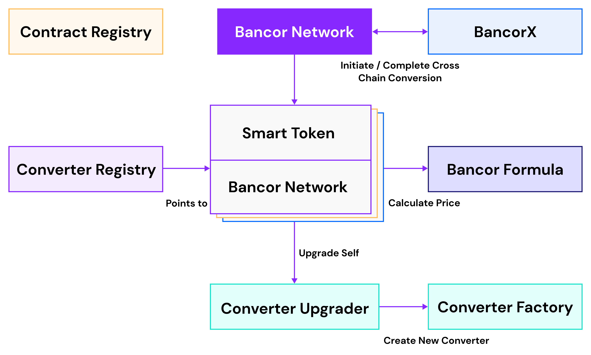

# Ethereum

The Bancor Network consists of a modular and upgradable smart contract design, while providing users with a simple interface they can interact with to either convert tokens or manage liquidity pools via a public API or a public interface for Dapp integrations. The Bancor Network smart contracts are open and accessible to network participants. Once new contracts are created, network participants can build interfaces atop the contracts, or interact with the contracts directly.

The main components in the network are the BancorNetwork contract, the SmartToken contract and the BancorConverter contract.

## Entities

### Bancor Network

The Bancor Network contract \(BancorNetwork\) manages the conversion flow by interacting with the different converters \(Liquidity Pools/Bancor Relays\).

All the converters in the network are connected together using a few common reserve tokens \(BNT token, USDB token\). Conversions can follow a path that consists of different converters and allows converting any token in the network to any other token by following a conversion path in a single transaction.

The BancorNetwork contract can receive a source token and conversion path - and follows the path interacting with multiple converters on the way - and then returns the target token to the caller.

The BancorNetwork contract also supports affiliate fees.The operator that integrates Bancor Network that allows users to convert tokens can choose to set and earn a small fee from each conversion that occurs via their reference. The fee is paid in BNT tokens, as the majority of conversions go through the BNT token as part of the conversion path.

### Liquidity Pools / Bancor Relays

“Liquidity Pools” and “Bancor Relays” are interchangeable terms on Bancor, with Bancor Relays constituting a specific implementation of a liquidity pool that includes two token reserves in a 50/50 ratio. Each Each liquidity pool in the Bancor Network consists of two separate smart contracts - a Smart Token contract and a Bancor Converter contract.

Liquidity pools are managed by their owners \(the entity that deployed the initial liquidity pool\) and liquidity providers and allows them to add/remove liquidity, upgrade the liquidity pool, decide on the fee in the pool etc.

### Smart Tokens

Smart Tokens are standard tokens with dynamic supply that increases when the tokens are purchased and decreased when they are sold.

Each Smart Token is managed by a single dedicated converter at any given point, though the address of that converter might change when it is upgraded.

Relay Tokens are a type of smart token that represent the holdings of each user in a given Liquidity Pool. When a liquidity provider contributes liquidity to a Bancor Relay, the liquidity provider receives Relay Tokens proportional to his/her ownership holding relative to the total liquidity pool. When more liquidity is contributed to a relay more relay tokens are issued.

Each Smart Token is managed by a single dedicated converter at any given point, though the address of that converter might change when it is upgraded.

### Converters

Each liquidity pool \(Bancor Relay\) is managed by a specific converter contract.

The converter holds other standard tokens as reserves and provides the logic that allow converting between the smart token and one of the reserves or between two reserves.

The converters use the Bancor Formula contract to calculate the return amount for a given conversion.

### Upgradability \(Ethereum Only\)

Converters can be upgraded to the latest official version in the network by their owners using the \`upgrade\` call. This results in a new converter contract that contains the reserves and settings of the existing converter. The previous contract is considered non functional at that point.

Converters can have 1 or more reserves.

### **Contract Registry \(Ethereum Only\)**

The Contract Registry contract contains the latest addresses for each contract in Bancor Network. The main goal is to allow the decoupling of different modules in the system and upgradability for the different contracts. Any contract in the system that requires interacting with another contract automatically requests the latest address of that contract from the contract registry.

