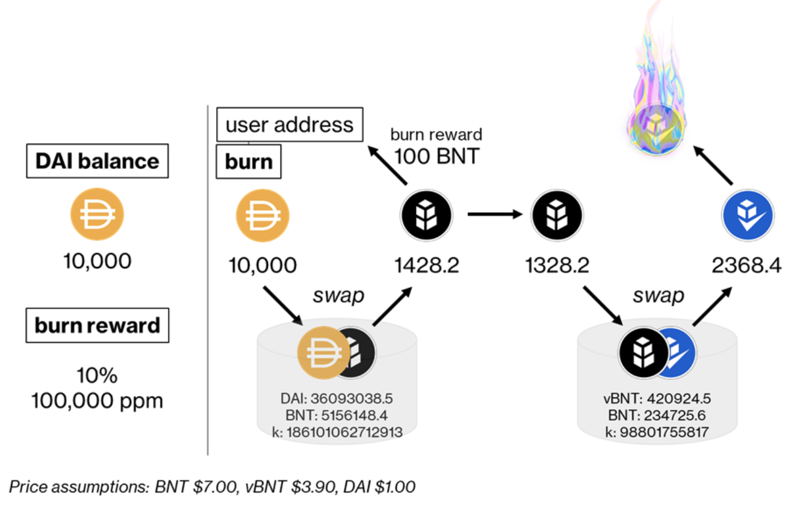

# Triggering the Bancor Vortex Burner

_**TLDR;**_

* A portion of swap fees from across the network is accumulated in a dedicated wallet. For simplicity, we will call this wallet the "Network Fee Wallet".&#x20;
* The Network Fee Wallet ([view on Etherscan](https://etherscan.io/address/0xeBcC959479634EEC5A4d7162e36f8B8cc763f491)) grants permission to withdraw its tokens to a second contract, the `VortexBurner`.
* The `VortexBurner` contract ([view on Etherscan](https://etherscan.io/address/0x2f87b1fca1769bc3361700078e1985b2dc0f1142)) is triggered externally via its burn function, which withdraws the specified tokens from the Network Fee Wallet. &#x20;
* When activated, the contract performs two actions:
  * 10% (100,000 ppm) of the available fees or 100 BNT (whichever is lower), is distributed to the address that initiates the relevant transaction, as a reward for their service.
  * The remaining funds are swapped via the network’s liquidity pools for vBNT, and the vBNT is burned.&#x20;
* The rewards to incentivise burning are adjustable by the DAO.

## `VortexBurner` Contract Details

The BancorDAO has previously approved [BIP9](https://gov.bancor.network/t/bip9-proposing-the-bancor-vortex/354), and its [addendum](https://gov.bancor.network/t/bip9-addendum-the-bancor-vortex-vbnt-burner-proposal-to-switch-to-a-flat-burn-rate/1015), which introduce a value capture mechanism of the protocol, and which is put to use in management of the BNT token supply. The `VortexBurner` contract is the realization of this policy. The following notes detail the discrete contract functions and their purpose.&#x20;

View the `VortexBurner` contract on [Etherscan](https://etherscan.io/address/0x2f87b1fca1769bc3361700078e1985b2dc0f1142).

## **`burnReward` | Determine the Value of Initiating a Burn**

The `burnReward` property returns the amount of BNT that the user will receive for calling the `burn` function (see below). The reward is offered to motivate regular token burns by sophisticated market algorithms. The `burnReward` **** property returns the current incentives as two different numbers:

* **Fractional amount.** For example, 10% (or 100,000 ppm). This is the proportion of the total value being burned that is returned to the address initiating the burn function, which is paid in BNT.&#x20;
* **Absolute amount.** For example, 100 BNT. This number is the highest amount payable; if the fractional amount exceeds the absolute amount, the payment defaults to the absolute amount.

The entity initiating a vBNT burn can query the contract prior to committing to a burn. It is important to realize that the BNT disbursement is funded from the held tokens, via a swap on its cognate liquidity pool. Therefore, slippage will impact the specific profits; however, this is likely to be a minor consideration. &#x20;

## **`burn` | Trigger the vBNT Burning Mechanism**&#x20;

The `burn` function is called for specific tokens; it is the responsibility of the entity calling the `burn` function to determine its profitability. Following its call, the tokens will be swapped in two hops for vBNT, and the vBNT will be burned. Importantly, part of the BNT obtained during the first hop is diverted to the address that initiated the `burn` function (see above). The `burn` function requires the token corresponding addresses to be passed, either as a single string, or a list. Since ETH has no address, one has been created for it on our system (`0xEeeeeEeeeEeEeeEeEeEeeEEEeeeeEeeeeeeeEEeE`).\
****

* **Single token case (ETH):`0xEeeeeEeeeEeEeeEeEeEeeEEEeeeeEeeeeeeeEEeE`**
* **Multi token case (ETH and LINK):**\
  **`0xEeeeeEeeeEeEeeEeEeEeeEEEeeeeEeeeeeeeEEeE`,**\
  **`0x514910771af9ca656af840dff83e8264ecf986ca`**\
  ****

### **A suggested procedure is:**

1. `balanceOf`: Read the available token balances and determine their value.
2. `burnReward`:  Query the current reward settings.
3. Calculate the expected return: Use the information above to determine the profitability of the transaction.
4. `burn`: If the total value of the disbursements is higher than the gas cost of execution, perform it.&#x20;

Consider the following example. Alice calls `balanceOf`, which returns a value of 10,000 DAI. The value of the DAI holdings is $10,000 according to Etherscan (or `getReturn` function on Bancor). Then she calls `burnReward`, which returns 10% (100,000 ppm) and a 100 BNT cap. The price of BNT is $7.00. To calculate the returns, Alice performs the following calculation:

* `$10,000 / 1,000,000 × 100,000 ppm = $1000`
* `$1000 / $7.00 = 140.28 BNT`

Since 140.28 BNT is higher than the 100 BNT cap, the reward amount is reduced to 100 BNT ($700). This is the amount Alice will receive for calling the burn method.

If the gas cost is < $700, then Alice makes an immediate profit from triggering the burn. The held DAI is swapped on the pool for 1428.2 BNT, of which 100 BNT is returned to Alice. The remaining 1328.2 BNT is then swapped for 2368.4 vBNT, and the vBNT is burned. \

## **`totalBurnedAmount` | Determine the Total vBNT Burned To-Date**

The `totalBurnedAmount` function returns the total amount of vBNT burned, ever. This data will help the BancorDAO to evaluate the effects of the Bancor Vortex over time. The effect is slow, but persistent. The BIP9 addendum introduced a schedule, whereby the vBNT burn rate starts at a modest 5%, and is slowly ramped to 15% over 18 months, commensurate with target APYs for liquidity providers on the network. The `totalBurnedAmount` function provides a readily available source of data that can be used in future token supply assessments, and should inform changes to the burn rate, as required to maintain a sustainable monetary policy. \
