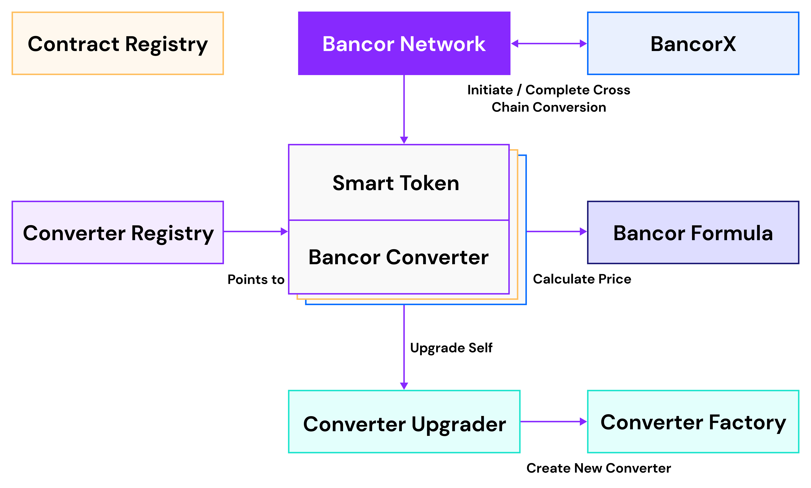

# Ethereum

The Bancor Network consists of a modular and upgradable smart contract design, while providing users with a simple interface they can interact with to either convert tokens or manage liquidity pools via a public API or a public interface for Dapp integrations. The Bancor Network smart contracts are open and accessible to network participants. As contracts are created, network participants can build interfaces atop the contracts, or interact with the contracts directly.

The main components in the network are the **BancorNetwork** contract, the **SmartToken** contract and the **BancorConverter** contract.

## Entities

### Bancor Network

The Bancor Network contract \(**BancorNetwork**\) manages the conversion flow by interacting with the different converter contracts.

All the converters in the network are connected together using a few common reserve tokens \(BNT token, USDB token\). Conversions can follow a path that consists of different converters. This allows for converting any token in the network to any other token by following a conversion path in a single transaction.

The BancorNetwork contract accepts a source token and a conversion path - and follows that path by passing through one or multiple converters along the way. Finally, the conversion reaches the target token and returns the trade amount to the caller.

The BancorNetwork contract also supports **affiliate fees**. The app operator or smart contract developer who integrates Bancor's conversion functions can choose to set and earn a small fee from each conversion routed via their reference. The fee is paid in BNT tokens, as the majority of conversions go through the BNT token as part of the conversion path.

### Smart Tokens

Smart Tokens are standard tokens with dynamic supply that increases when the tokens are purchased and decreased when they are sold. Each Smart Token is managed by a single dedicated converter at any given point, though the address of that converter might change when it is upgraded.

Smart tokens are the accounting basis for liquidity providers \(LP\), where each LP owns smart tokens proportional to their contribution to the pool.

### Liquidity Pools

Each liquidity pool in the Bancor Network consists of two separate smart contracts - a **Smart Token** contract and a **Bancor Converter** contract. Liquidity pools are managed by their owners \(the wallet that deployed the initial liquidity pool\) and liquidity providers and allow them to add/remove liquidity, upgrade the liquidity pool, decide on the fee in the pool etc.

### Liquid Tokens

Liquid Tokens are a derivative of Smart Tokens that are backed by only one reserve at a fractional ratio. While liquidity pools revolve around the underlying reserves that back the pool smart token, liquid tokens are focused on the smart token itself. Liquid tokens operate on a bonding curve where the reserve ratio is less than 100%. The price of tokens on bonding curves increase when supply increases and decrease when supply decreases, and liquid tokens are no different.

### Converters

Each liquidity pool is managed by a specific converter contract. The converter holds standard tokens \(e.g., BNT or DAI\) as reserves and provides the logic for conversions between a smart token and a reserve token or between two reserve tokens. The converters use the **BancorFormula** contract to calculate the return amount for a given conversion.

### Upgradability

Converters can be upgraded to the latest official version in the network by their owners using the `upgrade` call. This results in a new converter contract with some upgraded logic; however, all reserve and fee settings remain the same. At this point, the previous contract is decommissioned. 

### **Contract Registry**

The **ContractRegistry** contract contains the latest address for each contract in Bancor Network. The intention behind this contract is to allow for the decoupling of different modules in the system, as well as to allow for the upgradability of Bancor's various contracts. Any contract that needs to interact with another contract in the system will automatically request the latest address of that contract from the contract registry.

