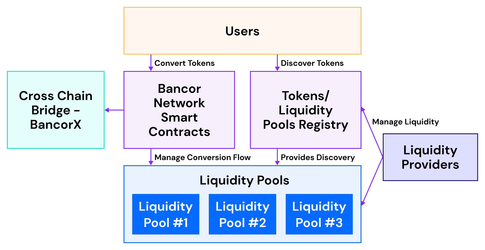

# Overview

The Bancor Network is a set of smart contracts that manages the conversion flow between tokens, including tokens on different blockchains. These contracts also manage access to the liquidity pools that connect the different tokens in the network.

The following is a broad overview of the different entities in the network and how they factor into the functionality of the protocol.

## Bancor Network Smart Contracts

The core Bancor Network smart contracts manage the conversion flow between tokens, as well as the administrative access to the different liquidity pools. The main entry point to the network is the **BancorNetwork** contract.

Users can call the different `convert` functions defined in the BancorNetwork contract to initiate a conversion between any token and any other token in the network, including those on other blockchains.

At the heart of the network is the **BNT** token, which acts as a hub that connects all the other tokens together. **USDB** is the stable version of BNT and is an alternative reserve currency for Bancor Network.

## Liquidity Pools

Every liquidity pool on Bancor Network aggregates liquidity for a discrete set of tokens on the network. Anyone can provide liquidity to a pool and, in return, receive conversion fees from trades that pass through the pool. Liquidity providers receive pool tokens proportional to their share of assets in the pool.

Every liquidity pool is managed by a **ConverterBase** contract, and liquidity providers can create new instances of the converter contract to create new liquidity pools. Anyone can call the `fund` or `liquidate` function to add or remove liquidity from a pool.

## Tokens / Liquidity Pools Registry

Every liquidity pool in Bancor Network is registered in the **BancorConverterRegistry** contract, a global registry to allow for easy discovery. Liquidity providers use the registry to find or create new pools where they might want to deploy capital. Users/traders use the registry to determine which tokens can be converted by the network and to determine which path a conversion might take.

Liquidity providers can call the `addConverter` or `removeConverter` functions to add or remove a liquidity pool to/from the registry.

Users can also call the `getConvertibleTokens` function to iterate through all the available tokens / liquidity pools in the registry.

## Cross-Chain Bridge \(BancorX\)

Bancor is a cross chain liquidity network. Any token in the network can be converted to any other token in the network, even if these tokens reside on different blockchains. This cross chain bridge is managed by the **BancorX** contract.

**BNT** token and its stable version **USDB** reside on multiple blockchains and can be transferred between the blockchains by any holder of the token.

Users can call the `xTransfer` function to transfer reserve tokens between the different blockchains or initiate a conversion in the network that will perform the reserve token transfer on their behalf.

